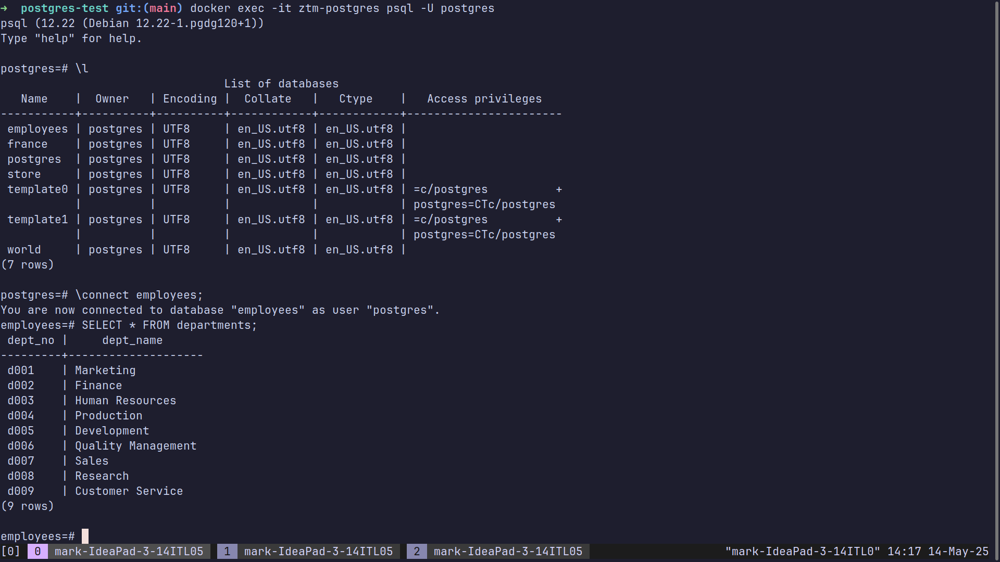

# ZTM Postgres Docker

Docker container seeded with the SQL dumps found in [Complete SQL + Databases Bootcamp: Zero to Mastery](https://zerotomastery.io/courses/sql-bootcamp/)

# Setup

## Requirements

```
- Docker installed
- `Data.zip` downloaded from the course 
```

## How To Run 

```
1. Unzip `Data.zip` and place the SQL files into the dumps folder

dumps
├── Employees.sql
├── France.sql
├── README.md
├── Store.sql
└── World.sql

2. Run `./ztm-docker-postgres.sh`
```

This will start the docker container, load the SQL dumps and after a short moment you are ready to connect!

## Connect

To connect into the docker container run

`docker exec -it ztm-postgres psql -U postgres`

This places you inside the container where you can now execute SQL commands and follow along with the course!

## Screenshots




